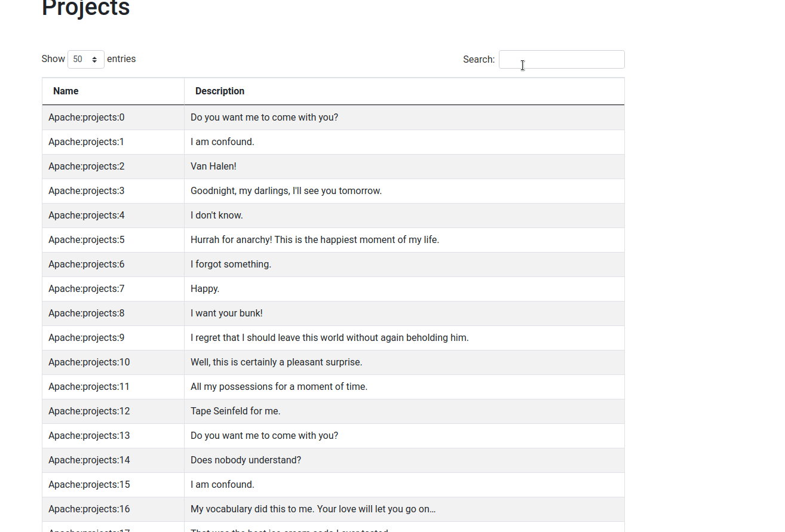

# Fake backend to play around with jquery datatables

## Why

I work in a project where datatables is a core component of the UI

For sure when we are playing with local data, we can just use arrays, 
but the things get complicated when you need remote server side processing (i.e paging and searching)


# How to run it:

You will need a backend, providing data in the following format:

```
{ name-of-the-key: [ {name: 'xx', description: 'yy' } ] }
```

We are providing a tool to generate some fake data. It can be called like:

```
$ ruby tools/generate_db.rb > server/db/db.json
```

Then just start the server:

```
$ cd server && rackup -p 4567
```

And open the `datatables.html` on your browser. To make sure that there is no issue with CORS, please open your chrome
*to navigate this local page only* with the following command:

```
google-chrome --disable-web-security --allow-file-access-from-files --allow-file-access --new-window --user-data-dir=$(mktemp -d -t ci-XXXXXXXXXX)  ./datatables.html 
```



Have fun!
